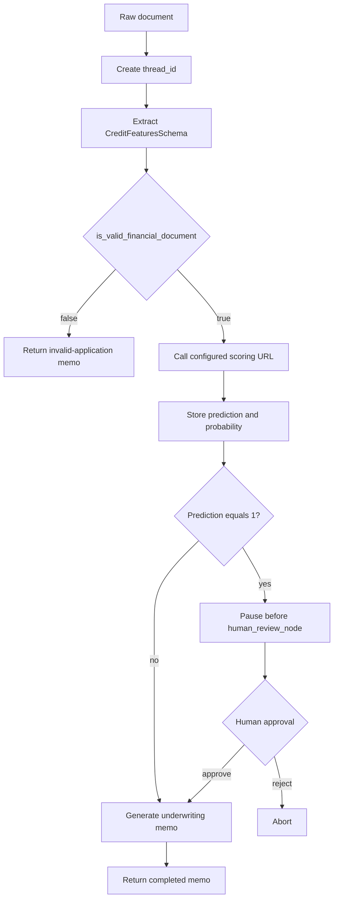

# Corporate Credit Due Diligence Agent

Corporate Credit Due Diligence Agent is a LangGraph-based underwriting workflow. It accepts unstructured loan or borrower information, extracts a normalized credit feature record with Gemini, sends that record to a deterministic credit-scoring service, and produces a Markdown underwriting memorandum. Applications classified as high risk pause for human approval before memo generation.

The repository contains:

- A Python/FastAPI backend and LangGraph workflow.
- A React/TypeScript/Vite frontend for streaming analysis and human review.
- Unit tests and trajectory evaluations for extraction and routing behavior.
- A Docker image for the backend API.

## Architecture


## Runtime workflow



The graph stores execution state by `thread_id`. `/analyze` streams node updates and finishes with either a completed memo or an interruption event. `/approve` resumes a paused thread or aborts it.

## Repository layout

```text
.
├── app.py                         FastAPI application and HTTP/SSE endpoints
├── main.py                        Local graph runner
├── console_tester.py              Interactive local runner with approval prompt
├── config/config.yaml             Model and scoring API configuration
├── src/
│   ├── agents/                    Extraction, scoring, and synthesis nodes
│   ├── config/                    YAML-backed configuration manager
│   ├── entity/                    Pydantic schema and LangGraph state
│   ├── graph/                     Graph construction and conditional routes
│   ├── logging/                   File logging setup
│   ├── tools/                     Scoring client and document utilities
│   └── utils/                     YAML and filesystem helpers
├── frontend/                      React/Vite user interface
├── tests/                         Unit tests for the scoring client
├── evals/                         End-to-end trajectory evaluations
├── research/                      Prototype notebook
├── Dockerfile                     Backend container image
└── .github/workflows/main.yml     CI lint, unit test, and evaluation workflow
```

## Prerequisites

- Python 3.12
- Node.js and npm (for the frontend)
- A Google API key with access to the configured Gemini model
- A running instance of the [CreditRiskScoring](https://github.com/AdityaRanganekar/CreditRiskScoring) service

## Configuration

Create a `.env` file in the repository root:

```dotenv
GOOGLE_API_KEY=your-google-api-key
```

Edit `config/config.yaml` as needed:

```yaml
model_settings:
  model_name: "gemini-3.5-flash-lite"
  max_retries: 3

api_settings:
  ## credit_scoring_url: "http://host.docker.internal:8000/predict_json"
  credit_scoring_url: "http://localhost:8000/predict_json"
  timeout_seconds: 10.0
```

The deterministic scoring service is maintained in the separate
[CreditRiskScoring repository](https://github.com/AdityaRanganekar/CreditRiskScoring). Start that
service before running this project. It must accept the extracted feature payload as JSON and
return at least:

```json
{
  "predicted_default": 0,
  "default_probability": 0.12
}
```

`predicted_default` is treated as `0` for standard processing and `1` for human escalation. The configured URL is loaded at runtime by `ConfigurationManager`; it is not supplied as an environment-variable override.

## Backend setup and use

Install Python dependencies in a virtual environment:

```bash
python3.12 -m venv .venv
source .venv/bin/activate
pip install -r requirements.txt
```

Start the API:

```bash
uvicorn app:app --reload --host 0.0.0.0 --port 8080
```

Interactive API documentation is available at `http://localhost:8080/docs`.

### Analyze a document

```bash
curl -N -X POST http://localhost:8080/analyze \
  -H "Content-Type: application/json" \
  -d '{"thread_id":"demo-1","raw_document":"Loan amount $12,000. Income $150,000. DTI 12%. 36 months at 5.5%."}'
```

The response is `text/event-stream`. Events contain graph updates, followed by either:

```json
{"status":"completed","memo":"..."}
```

or:

```json
{"status":"interrupted","pending_node":"human_review_node"}
```

### Approve or reject a paused review

```bash
curl -X POST http://localhost:8080/approve \
  -H "Content-Type: application/json" \
  -d '{"thread_id":"demo-1","approve":true}'
```

An approval resumes synthesis and returns `final_memo`. A rejection returns an aborted status.

### Run without the HTTP server

```bash
python console_tester.py
```

The console runner invokes the same graph, displays extracted features for interrupted high-risk cases, asks for approval, and writes completed memos to `memos/`.

## Frontend setup

```bash
cd frontend
npm ci
npm run dev
```

The Vite development server normally runs at `http://localhost:5173`. The UI is configured to call the backend at `http://localhost:8080`; the backend CORS policy permits that origin. The interface supports:

- Pasting raw loan application text.
- Streaming graph activity through SSE.
- Human approval or rejection for high-risk predictions.
- Rendering the returned Markdown memo.
- Exporting a memo as a PDF in the browser.

For a production frontend build:

```bash
npm run build
npm run preview
```

## Docker

Build and run the backend container:

```bash
docker build -t corporate-credit-due-diligence .
docker run --rm -p 8080:8080 \
  --env-file .env \
  corporate-credit-due-diligence
```

Before running the container, update `config/config.yaml` for host-based scoring-service access:

```yaml
api_settings:
  credit_scoring_url: "http://host.docker.internal:8000/predict_json"
  ## credit_scoring_url: "http://localhost:8000/predict_json"
```

In other words, comment out the second `credit_scoring_url` entry and uncomment the first
`host.docker.internal` entry. The Docker container cannot reach a scoring service running on the
host through `localhost`, because `localhost` refers to the container itself. Start the
[CreditRiskScoring service](https://github.com/AdityaRanganekar/CreditRiskScoring) on the host
before launching this container. On Linux, `host.docker.internal` may require adding
`--add-host=host.docker.internal:host-gateway` to `docker run`.

For local `uvicorn` or `console_tester.py` execution, reverse the configuration: comment out the
`host.docker.internal` URL and uncomment the `localhost` URL.

The image installs Python dependencies, copies `src/`, `config/`, and `app.py`, and starts Uvicorn on port `8080`.

## Data model

The extractor populates `CreditFeaturesSchema`, including:

- Loan terms: amount, term, interest rate, and installment.
- Borrower profile: income, employment length, home ownership, and verification status.
- Credit profile: DTI, account counts, revolving balance/utilization, public records, mortgages, and bankruptcies.
- Loan purpose and address state.
- `is_valid_financial_document`, which short-circuits unrelated or incoherent input.

The LangGraph state additionally carries the raw document, extracted features, risk prediction, risk probability, and generated underwriting memo.

## Testing and CI

Run the existing backend tests:

```bash
pytest tests/ -v
pytest evals/ -v
```

The CI workflow runs Python 3.12, Flake8 syntax/quality checks, unit tests, and trajectory evaluations. The trajectory cases verify feature extraction and ensure high-risk profiles interrupt at `human_review_node` while lower-risk profiles produce a memo.

## Limitations and operational considerations

- The Gemini model and API key are required for extraction and synthesis; the workflow does not provide an offline LLM fallback.
- The deterministic scoring service is maintained separately in the [CreditRiskScoring repository](https://github.com/AdityaRanganekar/CreditRiskScoring) and must be running at the configured URL.
- `MemorySaver` is process-local memory. Thread state is lost on process restart and is not suitable as durable production persistence.
- The API currently enables CORS only for `http://localhost:5173`.
- `/analyze` emits errors as SSE data events rather than a separate structured HTTP error response once streaming has begun.
- The default graph interrupt is based on `predicted_default == 1`; no additional policy thresholding is implemented in this repository.
- The input is treated as text. `load_financial_document` can read and normalize a local text extract, but no upload endpoint or SEC retrieval integration is implemented.
- The Docker image contains only the backend; the frontend is built and served separately.

## License

See [LICENSE](LICENSE).
