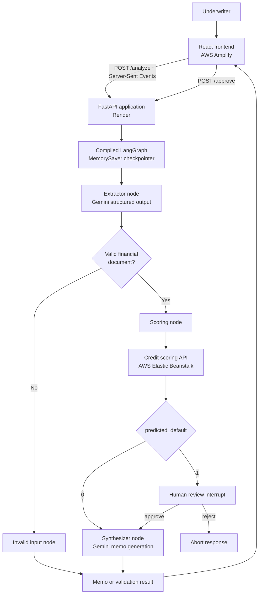
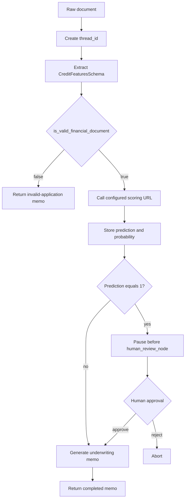

# Corporate Credit Due Diligence Agent

Corporate Credit Due Diligence Agent is a LangGraph-based underwriting workflow. It accepts unstructured loan or borrower information, extracts a normalized credit feature record with Gemini, sends that record to a deterministic credit-scoring service, and produces a Markdown underwriting memorandum. Applications classified as high risk pause for human approval before memo generation.

The repository contains:

- A Python/FastAPI backend and LangGraph workflow (Deployed on Render).
- A React/TypeScript/Vite frontend for streaming analysis and human review (Deployed on AWS Amplify).
- Unit tests and trajectory evaluations for extraction and routing behavior.
- A Docker image for the backend API.

## Architecture



## Runtime workflow



The graph stores execution state by `thread_id`. `/analyze` streams node updates and finishes with either a completed memo or an interruption event. `/approve` resumes a paused thread or aborts it.

## Repository layout

```text
.
├── app.py                         FastAPI application and HTTP/SSE endpoints
├── main.py                        Local graph runner
├── console_tester.py              Interactive local runner with approval prompt
├── config/config.yaml             Model and local scoring API configuration
├── src/
│   ├── agents/                    Extraction, scoring, and synthesis nodes
│   ├── config/                    YAML-backed configuration manager
│   ├── entity/                    Pydantic schema and LangGraph state
│   ├── graph/                     Graph construction and conditional routes
│   ├── logging/                   File logging setup
│   ├── tools/                     Scoring client and document utilities
│   └── utils/                     YAML and filesystem helpers
├── frontend/                      React/Vite user interface
├── tests/                         Unit tests for the scoring client
├── evals/                         End-to-end trajectory evaluations
├── research/                      Prototype notebook
├── Dockerfile                     Backend container image
└── .github/workflows/main.yml     CI lint, unit test, and evaluation workflow
```

## Prerequisites

- Python 3.12
- Node.js and npm (for the frontend)
- A Google API key with access to the configured Gemini model
- A running instance of the [CreditRiskScoring](https://github.com/AdityaRanganekar/CreditRiskScoring) service (hosted on AWS Elastic Beanstalk)

## Configuration

For local development, create a `.env` file in the repository root:

```dotenv
GOOGLE_API_KEY=your-google-api-key
```

When deploying to Render, you must inject these variables into the Web Service Environment Variables:
- `GOOGLE_API_KEY`: Your Gemini API key
- `CREDIT_SCORING_URL`: The live endpoint for your AWS Elastic Beanstalk ML service
- `PORT`: `8080` (to route Render traffic to Uvicorn)

The deterministic scoring service is maintained in the separate [CreditRiskScoring repository](https://github.com/AdityaRanganekar/CreditRiskScoring). It must accept the extracted feature payload as JSON and return at least:

```json
{
  "predicted_default": 0,
  "default_probability": 0.12
}
```

`predicted_default` is treated as `0` for standard processing and `1` for human escalation. 

## Backend setup and use

Install Python dependencies in a virtual environment:

```bash
python3.12 -m venv .venv
source .venv/bin/activate
pip install -r requirements.txt
```

Start the API:

```bash
uvicorn app:app --reload --host 0.0.0.0 --port 8080
```

Interactive API documentation is available at `http://localhost:8080/docs`.

### Analyze a document

```bash
curl -N -X POST http://localhost:8080/analyze \
  -H "Content-Type: application/json" \
  -d '{"thread_id":"demo-1","raw_document":"Loan amount $12,000. Income $150,000. DTI 12%. 36 months at 5.5%."}'
```

The response is `text/event-stream`. Events contain graph updates, followed by either:

```json
{"status":"completed","memo":"..."}
```

or:

```json
{"status":"interrupted","pending_node":"human_review_node"}
```

### Run without the HTTP server

```bash
python console_tester.py
```

The console runner invokes the same graph, displays extracted features for interrupted high-risk cases, asks for approval, and writes completed memos to `memos/`.

## Frontend setup

```bash
cd frontend
npm ci
npm run dev
```

The Vite development server normally runs at `http://localhost:5173`. 

To connect the frontend to the deployed Render backend on AWS Amplify, navigate to your Amplify environment settings and configure:
- `VITE_API_URL`: `https://[your-render-service].onrender.com`

The React interface uses `import.meta.env.VITE_API_URL` to route requests, bypassing hardcoded localhost URLs. The interface supports:

- Pasting raw loan application text.
- Streaming graph activity through SSE.
- Human approval or rejection for high-risk predictions.
- Rendering the returned Markdown memo.
- Exporting a memo as a PDF in the browser.

## Docker and Production Deployment

The backend is configured to be automatically built and deployed as a Docker container on Render via a GitHub integration. Every push to `main` triggers Render to pull the repository, build the `Dockerfile`, and deploy the updated image to a secure HTTPS URL.

If building locally:

```bash
docker build -t corporate-credit-due-diligence .
docker run --rm -p 8080:8080 \
  --env-file .env \
  corporate-credit-due-diligence
```

## Testing and CI

Run the existing backend tests:

```bash
pytest tests/ -v
pytest evals/ -v
```

The CI workflow (`main.yml`) runs on GitHub Actions for every push and pull request. It executes Python 3.12 Flake8 syntax/quality checks, unit tests, and trajectory evaluations. 

The trajectory cases verify feature extraction and ensure high-risk profiles interrupt at `human_review_node` while lower-risk profiles bypass human review and produce a memo. *Note: Trajectory evaluations require both `GOOGLE_API_KEY` and `CREDIT_SCORING_URL` to be present in your GitHub Repository Secrets to successfully contact the Beanstalk scoring API.*

## Limitations and operational considerations

- The Gemini model and API key are required for extraction and synthesis; the workflow does not provide an offline LLM fallback.
- The deterministic scoring service is maintained separately in the [CreditRiskScoring repository](https://github.com/AdityaRanganekar/CreditRiskScoring) and must be running at the configured URL.
- `MemorySaver` is process-local memory. Thread state is lost on process restart and is not suitable as durable production persistence. Render cold starts will clear active sessions.
- The FastAPI backend configures a wildcard CORS policy (`allow_origins=["*"]`) to allow connections from the remote AWS Amplify frontend. 
- `/analyze` emits errors as SSE data events rather than a separate structured HTTP error response once streaming has begun.
- The input is treated as text. `load_financial_document` can read and normalize a local text extract, but no upload endpoint or SEC retrieval integration is implemented.
- Render free tier instances will sleep after 15 minutes of inactivity, resulting in a ~50 second cold-start delay for the first request.

## License

See [LICENSE](LICENSE).